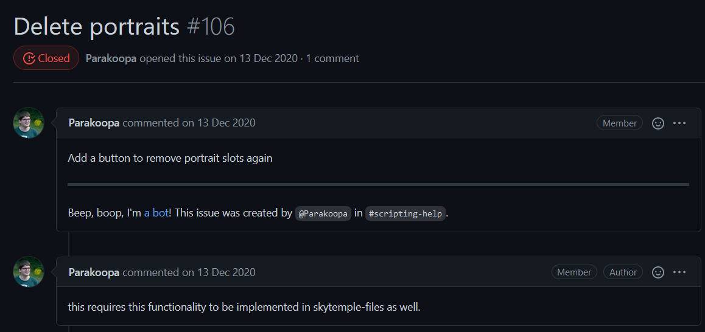
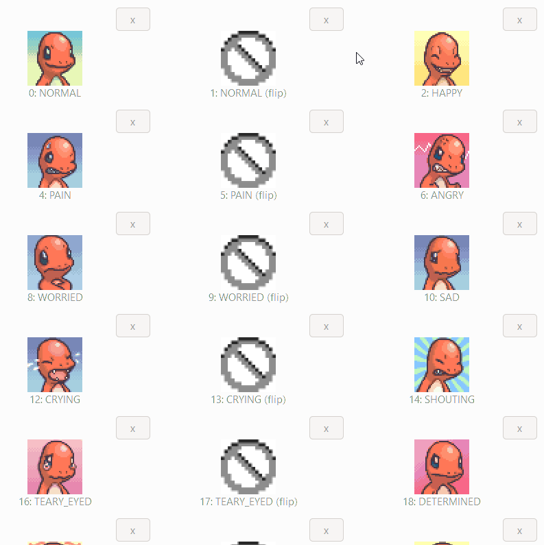

[SkyTemple](https://github.com/SkyTemple) is an open source ROM modification tool for Pokémon Mystery Dungeon: Explorers of Sky.

This project is hosted on **GitHub**, developed in **Python** and depends on the interface design tool [Glade](https://glade.gnome.org/). Since I have a strong attachment to this game and since I wanted to learn how to use these technologies, I contributed to this project.

As this project was quite young, there were many areas for improvement.

From the issues listed on the repository, I chose [this one](https://github.com/SkyTemple/skytemple/issues/106) :

I had to go through the process of understanding several key parts of the code to add this functionality, including the function to write the new data to the **ROM**, I communicated with other contributors to the project to assimilate some of the principles of the application. I also had to modify the **UI** with **Glade** to add the required buttons and link them to the code.

The finished feature looked like this, my [pull-request](https://github.com/SkyTemple/skytemple/pull/214) was accepted after a graphical modification by the main project developers.

