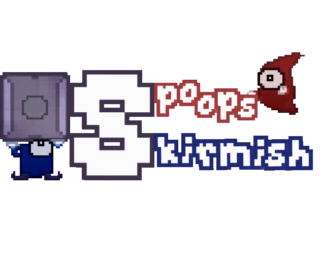
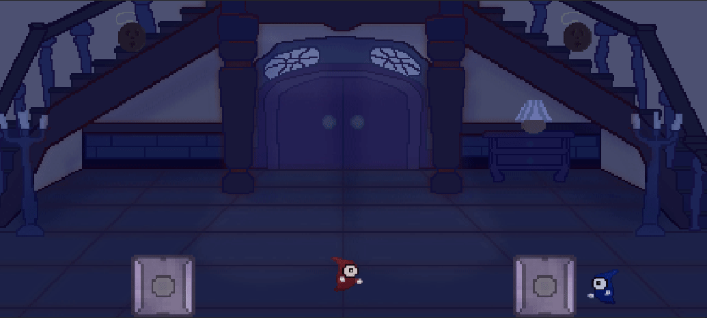
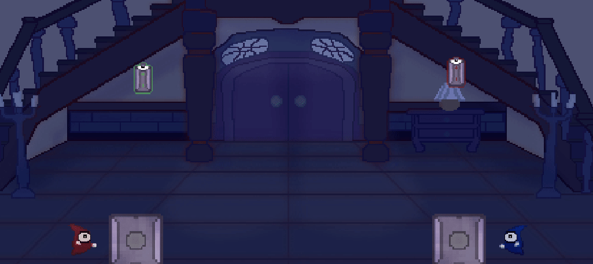
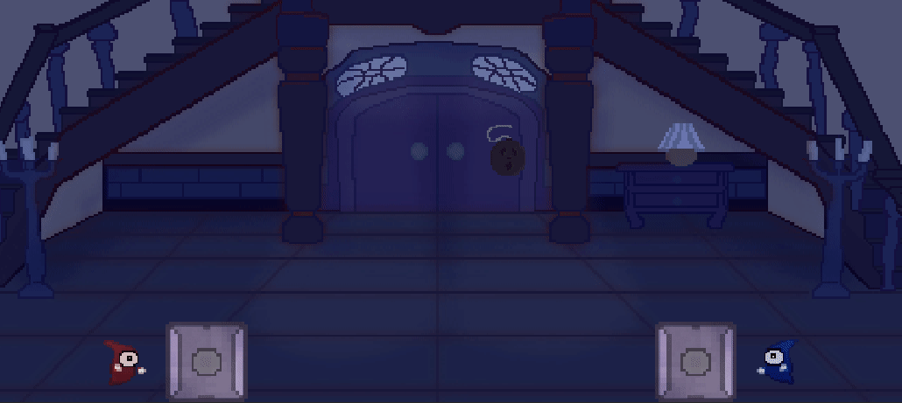

Spoops Skirmish is a locally playable keyboard fighting game, it was made from March 12 to 18, 2021 as part of WeeklyGameJam #192 which had the theme "Haunted Object". It can be played for free on [my itch.io page](https://dracau.itch.io/spoops-skirmish)

In this game, each player controls a red or blue ghost (called a Spoop), each has a block at their disposal that they can lift or haunt. When a block is haunted, it can shoot a beam of light that kills the opposing Spoop, it is also possible to kill a Spoop by crushing it with a block.

Each block has a certain amount of fuel in reserve, and it goes down very quickly. It is possible to manipulate this reserve by using objects that appear on the field, either by throwing the object on the block or by throwing the block on the object.

Green batteries fill the reserve, red batteries empty it.

There are also bombs, which produce an explosion when thrown on a block, they kill a Spoop if it is next to the block, or if it haunts the affected block.

This project was made in C# on Unity, it's my 1st Jam in team.

I took care of the game design and most of the programming work, I had the help of 2 friends: ADM and El Laggron, ADM managed the graphic design and the SFX, El Laggron programmed the mechanics of the light beam.

The feedback on this game, although less numerous than for Tentacle Draft because of the period, remained very positive despite a rather difficult handling.