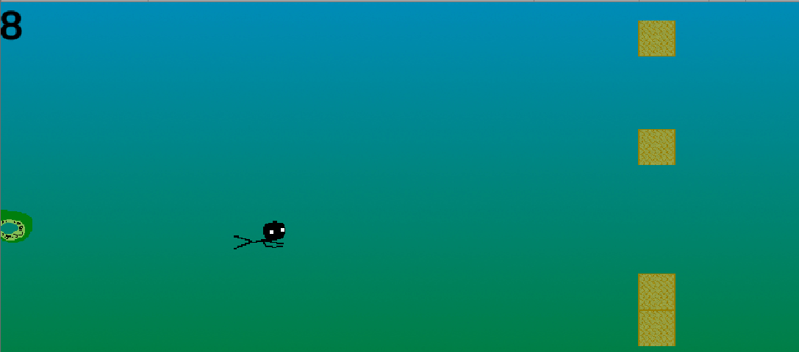
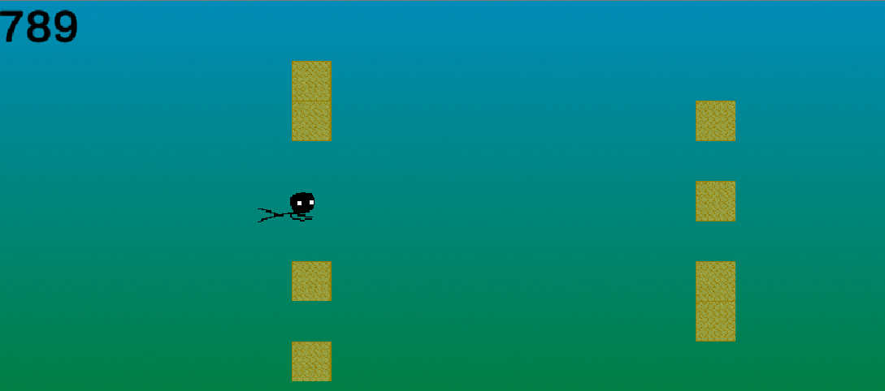

Tentacle Draft is a **single-player endless runner** that can be played on the keyboard. It was made from January 1st to 7th 2021 as part of the WeeklyGameJam #182, which had the theme "Cthulhu". It can be played for free on [my itch.io page](https://dracau.itch.io/tentacle-draft)

In this game, the player controls a stickman that he can move up and down with 2 buttons. The further the player moves, the more points he earns. To prevent him from moving forward, blocks and tentacles appear at a random frequency and location. The blocks force the player to choose a path, and the tentacles restrict the player's movement. When the player hits a block or tentacle, they have lost and get their final score.

When the player reaches certain thresholds of points, the difficulty of the game increases, the blocks moves faster, the tentacles appear more frequently and in greater numbers. A new type of tentacle also appears, where the classic green tentacles are slow and serve to block the player, the red tentacles arrive very quickly and force the player to make a quick decision.

I made this game alone in **C#** on **Unity**, it is my first **Jam project** and **my first "complete" game**. Although this game is simple and I couldn't include all my ideas, I'm proud that I was able to produce a playable prototype within the time limit, and this only on my own time.

The feedback on this game has been very encouraging, both from my friends and from the other participants of the Jam, especially as the areas of improvement I was given were the ideas I did not have time to include.