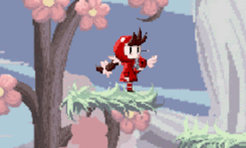
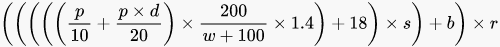

The GT is a community around the video game, the members of this community have very different talents (programming, game design, art...), so we wanted to create a game together.

The GT Fighting Game is a platform fighter (or a Smash Bros. Like) where each member of the community can think about the mechanics and the design of his own character, then we all work together on the creation of this character.

This project was started in August 2021 and slowed down with the start of the school year. The main features like the movement system, some attacks, damage proportional ejection and hitstun are in place.

To recreate the ejection, I searched the internet for the formulas used in the Super Smash Bros. series and picked the one used in Super Smash Bros. Ultimate, which is:

- where **p** is the opponent's total damage after taking the hit,

- **d** is the damage inflicted by the hit,

- **w** is the weight of the target,

- **s** is the evolution of the ejection from the hit,

- **b** is the default ejection of the hit,

- **r** represents various modifiers related for example to objects, I have ignored it until now.

This project is developed entirely on Unity, I'm in charge of programming and game design.