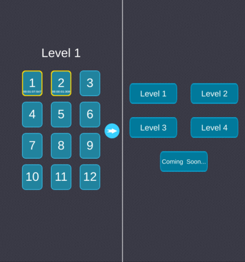

Hitori is a reproduction of the [Japanese logic game of the same name](https://fr.wikipedia.org/wiki/Hitori) in a **mobile game format**.

I started this project to have a first experience of creating a mobile game and potentially publishing a game on the stores.

The game is presented as a series of Hitori grids with an increasing size according to the level.

I did this project alone on **Unity** in **C#**, between October and November 2021.