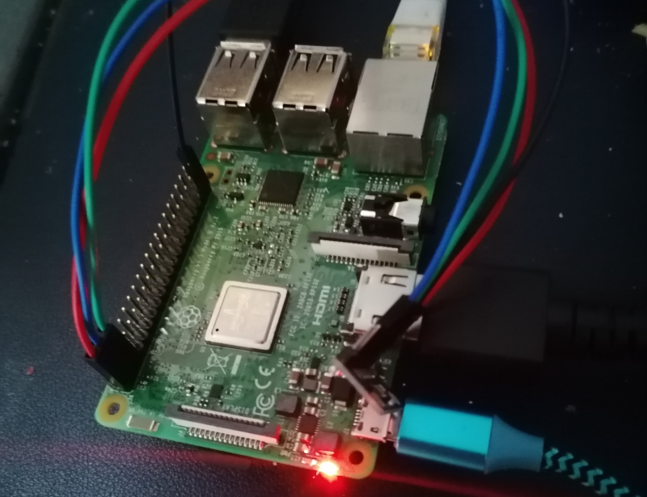
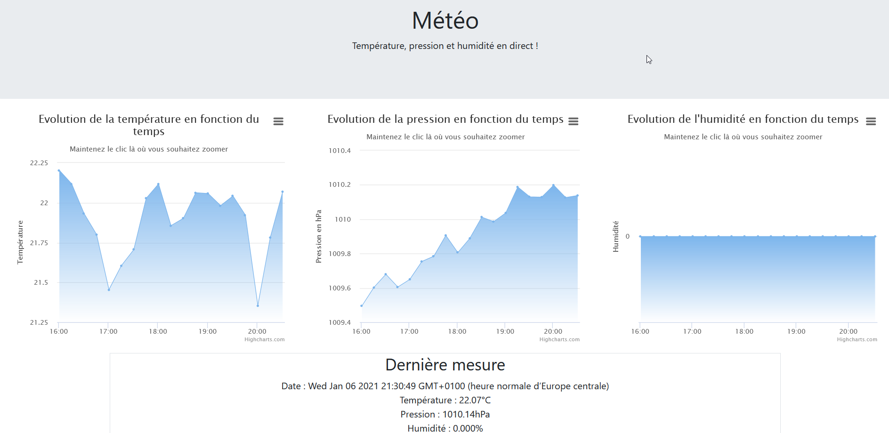

The weather station is a project proposed by the CNED for the second year of the BTS formation (BTEC Equivalent). It consists in using a **Raspberry Pi 3 B+**, the **QT5 api**, **a pressure, temperature and humidity sensor** in order to obtain a website displaying these data on a graph.

**QT5** and the **C++** language allowed me to retrieve the data via the sensor connected to the **GPIO ports** of the Raspberry Pi.

*The humidity remains at 0 because of a defect on the sensor used*.

To integrate the data on a web page, I used **Javascript/JQuery**, **Ajax/JSON**, as well as the **Hightcharts and Bootstrap APIs**.

I realized this project alone from the beginning to the end, since the CNED courses are only done by correspondence.