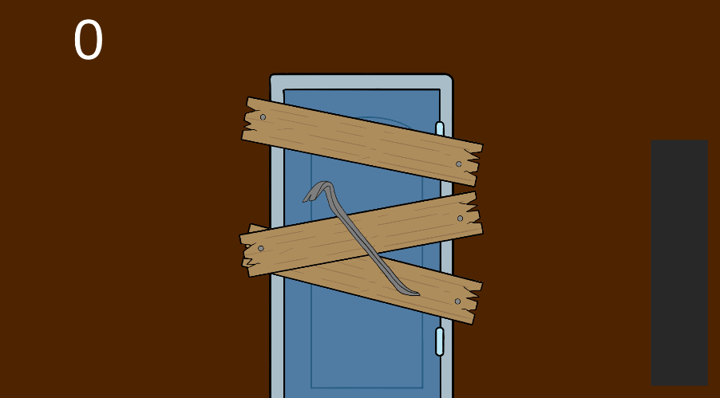

The **Bachelor Game Programming** year at [Rubika](https://rubika-edu.com/) includes a **Wario Ware like** project running from October 2021 to the end of January 2022.

This project is carried out in **cooperation between the Game Programming and Game Design streams**, i.e. about 40 students. The organisation of the project is designed to **reproduce the organisation of a studio**, with trios in charge of developing the Wario Ware mini-games, team leaders and macro-game managers.

In this project I am a member of a trio. Each trio has to produce at least 3 mini-games, as of now I'm managing the **programming part of 2 of these mini-games**, and I'm at the origin of the concept of one of them.

Each of the mini-games must be based on two values provided by the macro-game: the **difficulty** and the **speed** of the game.

Here are the mini-games I am working on, this is not their final version, but this is how they should appear in the alpha of the project scheduled for January 7, 2022.

**Dans l'Ombre du Chariot**

In this mini-game, the player has to cross a corridor by hiding behind a trolley, to avoid the guard spotting him with his torch. If he crosses the corridor without being spotted, he has won, if he is spotted or the cart crosses without him, he has lost. I came up with the concept for this mini-game.

The **difficulty** affects the size of the cart and its behaviour:
- In level 1 the cart is wide and crosses in a straight line at a constant speed
- On level 2 the cart is wide but stops at a random point during its run, forcing the player to stop too
- In level 3 the cart is smaller, and stops in the same way as in level 2

The **speed** affects the speed of the trolley and the player in the same way.

**Pied au Plancher**

In this mini-game, the player has to remove the planks blocking a door one by one by mashing a button. If he removes all the boards before the end of the time limit, he has won, if not he has lost.

The **difficulty** affects the number of planks to remove, from 3 to 7.

The **speed** affects the time allowed to remove the planks, the speed of movement of the crowbar and the speed at which he can mash the button.