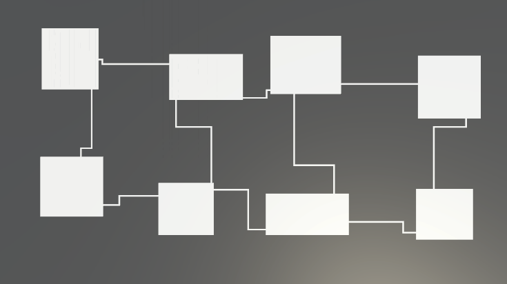
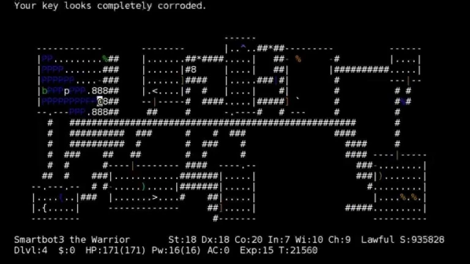

Pokémon Mystery Dungeon is a turn-based roguelike series. I've been following this series a lot and recreating its level generation system seemed like a great opportunity to dissect a game and learn more about procedural generation.

After some research on the internet and on my side, it seems that this game uses a Space Partitioning technique: the map is divided into X rows and Y columns, then each division decides either to create a room, to create a single point which will be connected after the creation of the corridors, or to create nothing at all. Then each room has a chance to be connected to another near room,unfortunately this leads to many invalid maps due to inaccessible rooms. This technique was also used in games like Nethack.

There are many possible "rule sets" in the original game, which force for example large and close rooms for the beginning of the game, and very small and distant rooms for the end of the game. Here I have only created a ruleset resembling the beginning of the game.

This project is developed entirely on **Unity**.