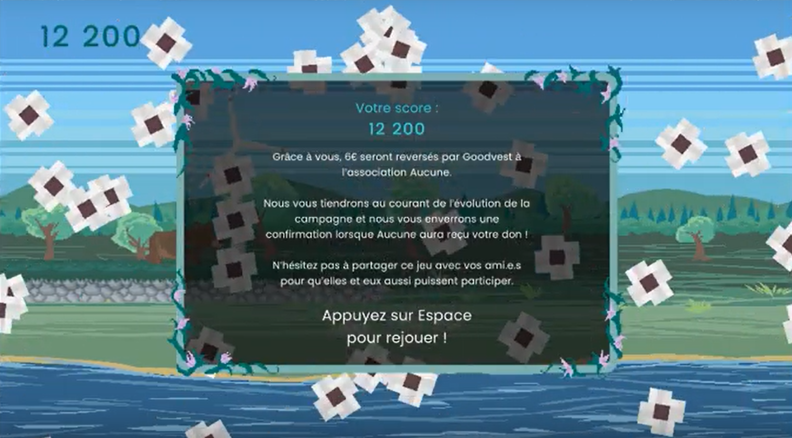

Mission freelance d’une semaine pour une
entreprise de conseil en investissement.

J’ai été missionné pour créer un runner en 2D dans un univers centré sur
l’écologie. Les points récoltés par les joueurs étaient convertis en dons pour des associations en lien avec la
protection de l’environnement.

J'ai aussi créé un outil permettant à l'entreprise des récupérer la liste des joueurs et de leurs scores.

Cette mission a duré une semaine, j'ai intégralement réalisé le game design et la programmation de ce jeu sur **Unity**, en me basant sur le cahier des charges fourni par l'entreprise.