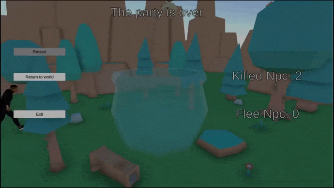

La première année de Mastère Game Programming à Rubika comprend un projet à destination de Steam, s'étalant de novembre 2022 à janvier 2023.

Ce projet est réalisé en coopération entre la filière Game Programming et la fillière Game Design, en équipes de 6 élèves.

Dans ce jeu on joue un ours qui essaie de dormir mais est gêné par la fête bruyante de son voisin. Le joueur doit donc aller interrompre la fête en tuant le plus de fêtards possibles grâce aux objets trouvables dans la maison.

Dans ce projet j'ai pris le rôle de développeur gameplay et tool. Je me suis principalement concentré sur la modularite du contrôleur du joueur, sur le système d'objets et la fluidité de leur intégration par les tools.