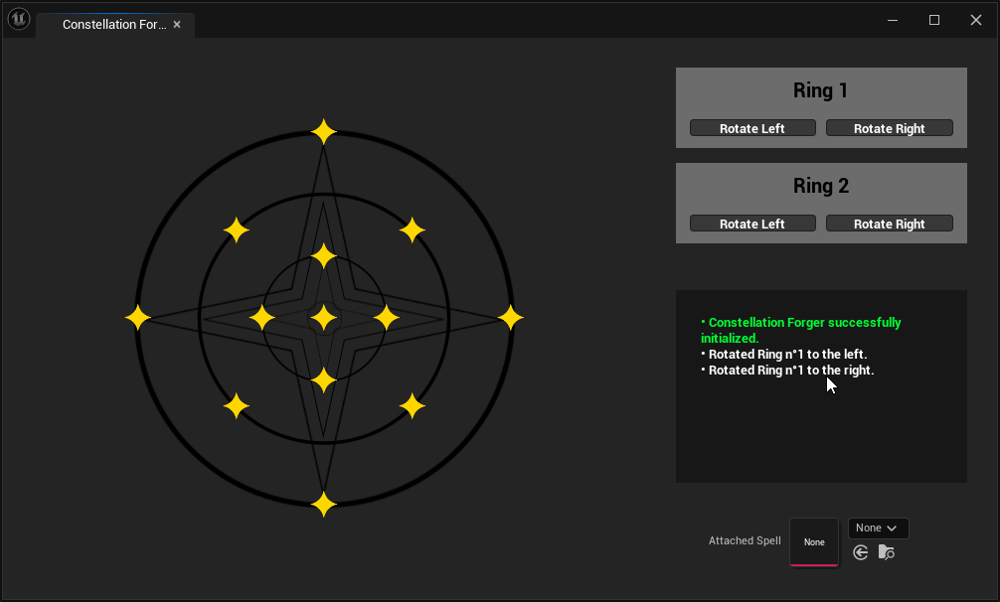

Le cursus Game de Rubika se termine par une année consacrée entièrement à un projet de jeu, dans mon cas, il s'agit de SpellGazer.

SpellGazer est un jeu solo d'exploration et d'observation, dans lequel le joueur doit trouver des constellations cachées dans l'environnement et les tracer pour apprendre des sortilèges. Grâce à ces sortilèges, il pourra manipuler ce qu'il trouve autour de lui...

Le principal défi de ce projet réside dans les interactions entre les divers éléments du jeu, elles sont nombreuses et ont souvent des cas particuliers :

Par exemple, avec le sort "Expand", le joueur peut agrandir certains objets, seulement, lorsque certains objets grandissent leur comportement change drastiquement, par exemple les étoiles se mettent à brûler leurs alentours, ce qui conduit les objets exposés à la chaleur à changer leur comportement et ainsi de suite.

Ce projet est réalisé en coopération avec une équipe de 10 personne constituée de Game Artists, Designers et Programmers.

Dans ce projet j'ai pris le rôle de développeur Unreal gameplay et tool. 

Je travaille principalement autour des différents sorts, le jeu étant très systémique il faut avoir l'architecture la plus efficace possible.

Etant également développeur de tools, j'ai aussi créé un outil permettant d'intégrer les constellations simplement depuis l'éditeur, et ce de la même façon qu'en jeu. Cet outil fait gagner énormément de temps à l'équipe car sans lui il faudrait entrer point par point les coordonnées du tracé. 

Cet outil se base sur le même code que les constellations en jeu, ce qui signifie que l'outil évoluera automatiquement si on modifie la manière de fonctionner des constellations en jeu.

